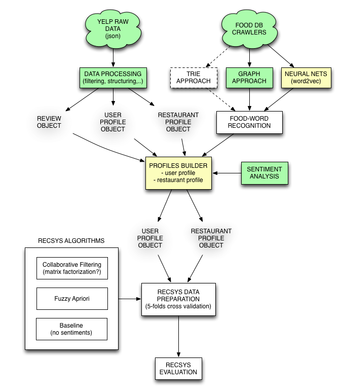

<h2>BuonAppetito</h2>

Extension of the first work on menu recommendation.

Michele Trevisiol, Luca Chiarandini, Ricardo Baeza-Yates “[Buon Appetito - Recommending Personalized Menus](http://www.micheletrevisiol.com/papers/ht2014_trevisiol.pdf)”, September 1 – 4 2014, Santiago, Chile, ACM conference on Hypertext and Social Media, [HT2014](http://ht.acm.org/ht2014/)

<h6>Repository Structure</h6>
* `data` : contains the data in RAW and post-processed format
* `src` : contains all the modules explained in the planning diagram with a simple README that explains the basic functionalities
* `model` : contains the models or objects that are called by different modules
* `planning` : it simply contains the diagrams

<h6>Planning</h6>

<h6>iPython Notebook</h6>
* [TextProcessing](http://nbviewer.ipython.org/github/xarabas/BuonAppetito/blob/master/Play_TextProcessing.ipynb?flush_cache=true)
* [GraphDishesAndIngredients](http://nbviewer.ipython.org/github/xarabas/BuonAppetito/blob/master/Play_GraphDishesAndIngredients.ipynb?flush_cache=true)

<h6>ToDo</h6>
* Research similar work for food-word detection and recognition
* Work on the food-item matching 
* Build user and business profile: think how to split it by time for train, validation and test set (CV)

<h6>Add References</h6>
* Flavor network and the principles of food pairing, 2011
* Comparing and combining snetiment analysis methods, 2013